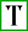
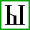
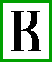
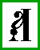
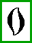
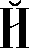
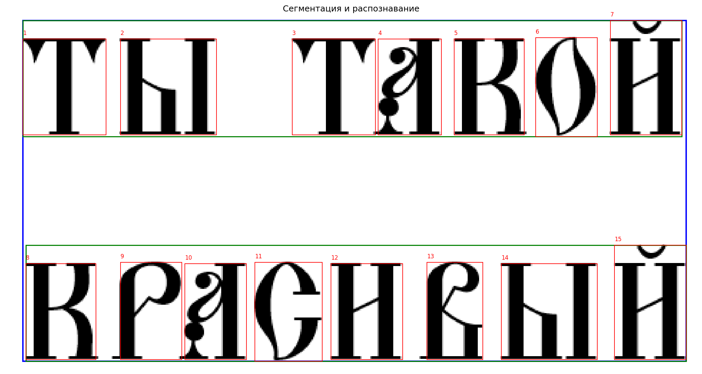
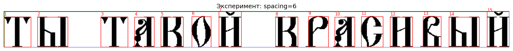

# Лабораторная работа №7
## Классификация на основе признаков, анализ профилей

### Описание

Проект на **Python**, реализующий классификацию символов на основе признаков, профилей и сравнения нормализованных изображений.

В работе используется алфавит **«Кириллица заглавные»** и шрифт **Ponomar Unicode**.  
Программа использует наработки предыдущих лабораторных работ:

1. генерация эталонных изображений символов;
2. вычисление признаков символов;
3. построение горизонтальных и вертикальных профилей;
4. сегментация входной строки на отдельные символы;
5. сравнение каждого найденного символа со всеми символами алфавита;
6. формирование списка гипотез для каждого символа;
7. вывод распознанной строки;
8. оценка количества ошибок и точности распознавания;
9. проведение эксперимента с другим размером шрифта.

Для каждого символа распознаваемой строки формируется набор гипотез:

- **1 символ = N гипотез**,
- где `N` — количество символов в выбранном алфавите.

Гипотезы сортируются по убыванию меры близости.

---

# Используемый алфавит

В работе используется следующий набор символов:

```text
А Б В Г Д Є Ж Ѕ З И І Й К Л М Н О П Р С Т Ѹ Ф Х Ц Ч Ш Щ Ъ Ы Ь Ѣ Ю Ѵ Ѯ Ѱ Ѡ Ѧ Ѩ
```

Алфавит используется для построения базы эталонных символов и классификации найденных сегментов.

---

# Исходная фраза

В программе задана исходная фраза:

```text
ТЫ ТАКОЙ КРАСИВЫЙ
```

Перед сравнением строка нормализуется: из неё удаляются пробелы и остаются только символы из выбранного алфавита.

```text
ТЫТАКОЙКРАСИВЫЙ
```

---

# Используемый шрифт

Для генерации эталонных изображений и экспериментальной строки используется шрифт **Ponomar Unicode**.

Установить его можно из архива:

```text
Ponomar Unicode.zip
```

---

# Основные настройки

В коде используются следующие настройки:

```text
FONT_SIZE = 52
EXPERIMENT_FONT_SIZE = 60
BINARIZE_THRESHOLD = 200
CROP_PADDING = 0
CANVAS_SIZE = (240, 240)
TEXT_CANVAS_SIZE = (2400, 400)
NORMALIZED_SIZE = (64, 64)
NORMALIZED_PADDING = 6
```

### FONT_SIZE

Кегль шрифта для построения эталонных символов. В данной работе используется размер 52.

### EXPERIMENT_FONT_SIZE

Кегль шрифта для экспериментальной строки. Он отличается от исходного размера на несколько пунктов:

```text
EXPERIMENT_FONT_SIZE = FONT_SIZE + 8
```

### BINARIZE_THRESHOLD

Порог бинаризации изображения. Пиксели темнее порога считаются чёрными.

### CROP_PADDING

Дополнительный отступ после обрезки белых полей.

### CANVAS_SIZE

Размер холста, на котором рисуется отдельный эталонный символ перед обрезкой.

### TEXT_CANVAS_SIZE

Размер холста, на котором генерируется экспериментальная текстовая строка.

### NORMALIZED_SIZE

Размер, к которому приводится каждый символ перед вычислением признаков и сравнением.

---

# Входное изображение

Программа ищет входной BMP-файл в папке со скриптом.

В первую очередь проверяются файлы:

```text
phrase.bmp
text.bmp
```

Если эти файлы не найдены, используется первый найденный файл с расширением `.bmp`.

Также путь к изображению можно указать вручную в переменной:

```text
INPUT_IMAGE
```

---

# Эталонные изображения символов

Для каждого символа алфавита создаётся эталонное изображение.

Этапы построения эталона:

1. символ рендерится выбранным шрифтом;
2. изображение переводится в бинарный вид;
3. белые поля обрезаются;
4. символ нормализуется к размеру `64 x 64`;
5. для символа рассчитываются признаки и профили.

Эталонные изображения сохраняются в папку:

```text
lab7_output/reference_symbols/
```

Файл сохраняется с безопасным именем в формате:

```text
U+КОД_СИМВОЛ.png
```

---

# Примеры эталонных изображений

| Символ Т | Символ Ы | Символ К |
|---|---|---|
|  |  |  |

| Символ А | Символ О | Символ Й |
|---|---|---|
|  |  |  |

---

# Вычисляемые признаки

Для каждого символа рассчитывается вектор признаков.

## Относительная масса

Вычисляется доля чёрных пикселей в изображении:

```text
mass_rel
```

## Координаты центра тяжести

Вычисляются координаты центра тяжести чёрных пикселей:

```text
center_x_norm
center_y_norm
```

Координаты нормируются по ширине и высоте изображения.

## Осевые моменты инерции

Вычисляются нормированные осевые моменты инерции:

```text
Ix_norm
Iy_norm
```

## Удельный вес по четвертям изображения

Изображение делится на 4 части:

- верхняя левая;
- верхняя правая;
- нижняя левая;
- нижняя правая.

Для каждой четверти вычисляется относительная плотность чёрных пикселей:

```text
q1_relative_weight
q2_relative_weight
q3_relative_weight
q4_relative_weight
```

## Профили X и Y

Для нормализованного символа строятся профили:

- `X` — сумма чёрных пикселей по столбцам;
- `Y` — сумма чёрных пикселей по строкам.

Профили нормируются и используются при расчёте общей меры близости.

---

# Таблица эталонных признаков

Скалярные признаки эталонных символов сохраняются в CSV-файл:

```text
lab7_output/reference_features.csv
```

В таблицу записываются:

- символ;
- Unicode-название;
- относительная масса;
- нормированные координаты центра тяжести;
- нормированные моменты инерции;
- путь к изображению символа.

---

# Сегментация строки

Перед классификацией входное изображение сегментируется.

Алгоритм выполняет следующие действия:

1. перевод изображения в оттенки серого;
2. бинаризация;
3. поиск общего обрамляющего прямоугольника текста;
4. построение горизонтального профиля;
5. выделение строк;
6. построение вертикального профиля для каждой строки;
7. выделение символов;
8. уточнение прямоугольников символов;
9. сохранение вырезанных символов.

Для сегментации используются профили с прореживанием.

---

# Классификация символов

Для каждого найденного символа выполняются следующие шаги:

1. символ вырезается из входного изображения;
2. изображение нормализуется к размеру `64 x 64`;
3. вычисляются скалярные признаки;
4. строятся профили `X` и `Y`;
5. символ сравнивается со всеми эталонами алфавита;
6. формируется список гипотез;
7. гипотезы сортируются по убыванию меры близости.

---

# Мера близости

В программе используется комбинированная мера расстояния.

Сравнение выполняется по следующим компонентам:

```text
SCALAR_WEIGHT = 0.30
PROFILE_X_WEIGHT = 0.20
PROFILE_Y_WEIGHT = 0.20
BITMAP_WEIGHT = 0.30
```

Общее расстояние включает:

- расстояние между скалярными признаками;
- расстояние между профилями `X`;
- расстояние между профилями `Y`;
- отличие нормализованных бинарных изображений.

Мера близости вычисляется по формуле:

```text
similarity = 1 / (1 + distance)
```

Если расстояние равно нулю, мера близости равна `1.0`.

---

# Гипотезы распознавания

Для каждого символа сохраняется список гипотез в формате:

```text
1: [('Т', 0.959986), ('І', 0.918368), ('Щ', 0.91609), ...]
2: [('Ы', 0.974984), ('Ш', 0.915671), ('Ю', 0.914103), ...]
```

Гипотезы для входного изображения сохраняются в файл:

```text
lab7_output/input_hypotheses.txt
```

Гипотезы для экспериментального изображения сохраняются в файл:

```text
lab7_output/experiment_hypotheses.txt
```

---

# Вывод распознанной строки

После классификации из первых гипотез формируется итоговая строка.

Для входного изображения получен результат:

```text
ТЫТАКОЙКРАСКВЫЙ
```

Для экспериментального изображения получен результат:

```text
ТЫТАКОЙКРАСИВЫЙ
```

---

# Оценка качества распознавания

Распознанная строка сравнивается с нормализованной исходной строкой:

```text
ТЫТАКОЙКРАСИВЫЙ
```

Вычисляются:

- количество символов;
- количество верно распознанных символов;
- количество ошибок;
- точность распознавания в процентах.

## Результат для входного изображения

```text
Распознанная строка: ТЫТАКОЙКРАСКВЫЙ
Количество символов: 15
Верно: 14
Ошибок: 1
Точность: 93.33%
```

## Результат эксперимента

```text
Размер шрифта: 60
Подобранный spacing: 6
Распознанная строка: ТЫТАКОЙКРАСИВЫЙ
Количество символов: 15
Верно: 15
Ошибок: 0
Точность: 100.00%
```

---

# Эксперимент с другим размером шрифта

В рамках эксперимента программа генерирует исходную строку шрифтом другого размера:

```text
EXPERIMENT_FONT_SIZE = 60
```

Для повышения качества сегментации перебираются варианты межбуквенного расстояния:

```text
EXPERIMENT_SPACING_CANDIDATES = [0, 2, 4, 6, 8, 10, 12, 14, 16]
```

Выбирается вариант, при котором количество сегментов ближе всего к ожидаемому количеству символов, а средняя мера близости максимальна.

---

# Визуализация сегментации

Для входного и экспериментального изображения сохраняются визуализации с прямоугольниками:

- синий прямоугольник — область текста;
- зелёный прямоугольник — строка;
- красные прямоугольники — найденные символы.

Файлы сохраняются в папку:

```text
lab7_output/visualizations/
```

---

# Примеры визуализации

| Входное изображение | Эксперимент |
|---|---|
|  |  |

---

# Установка

Установка зависимостей:

```bash
pip install pillow numpy matplotlib
```

---

# Запуск программы

Запуск программы:

```bash
python laba7.py
```

---

# Примечание

Для программы нужно указать путь к шрифту вручную в переменной:

```text
FONT_PATH
```

Если входное изображение не находится автоматически, путь можно указать вручную в переменной:

```text
INPUT_IMAGE
```


---
# Сравнение точностей результатов (в первом варианте точность 93.33%, а во втором 100%)

Точность считается как доля верно распознанных символов от общего количества символов:

```text
accuracy = correct / total * 100%
```

Нормализованная исходная строка содержит 15 символов:

```text
ТЫТАКОЙКРАСИВЫЙ
```

## Первый вариант: входное BMP-изображение

Для входного изображения программа получила строку:

```text
ТЫТАКОЙКРАСКВЫЙ
```

Сравнение с эталоном:

```text
Эталон:      ТЫТАКОЙКРАСИВЫЙ
Распознано:  ТЫТАКОЙКРАСКВЫЙ
```

Ошибка находится в 12-й позиции:

```text
Эталонный символ:      И
Распознанный символ:   К
```

Поэтому результат считается так:

```text
Всего символов: 15
Верно:          14
Ошибок:         1
Точность:       14 / 15 * 100% = 93.33%
```

Причина ошибки — символ `И` оказался похож на группу символов `К / П / Н / И` по рассчитанным признакам, профилям и нормализованному бинарному изображению. В файле гипотез для 12-го символа видно, что несколько вариантов имеют близкие оценки:

```text
12: [('К', 0.970530), ('П', 0.974027), ('И', 0.963080), ('Н', 0.959709), ...]
```

То есть правильная буква `И` присутствует среди первых гипотез, но не была выбрана как итоговая первая гипотеза. Из-за этого в итоговую строку попала буква `К`.

## Второй вариант: экспериментальное изображение

Для экспериментального изображения программа сама сгенерировала строку другим размером шрифта:

```text
EXPERIMENT_FONT_SIZE = 60
```

Также был подобран межбуквенный интервал:

```text
spacing = 6
```

В результате была распознана строка:

```text
ТЫТАКОЙКРАСИВЫЙ
```

Она полностью совпадает с эталоном:

```text
Эталон:      ТЫТАКОЙКРАСИВЫЙ
Распознано:  ТЫТАКОЙКРАСИВЫЙ
```

Поэтому результат считается так:

```text
Всего символов: 15
Верно:          15
Ошибок:         0
Точность:       15 / 15 * 100% = 100.00%
```

Для того же 12-го символа в эксперименте первая гипотеза уже правильная:

```text
12: [('И', 0.967218), ('К', 0.956669), ('П', 0.963943), ('Н', 0.963516), ...]
```

## Основной вывод

В первом варианте программа работала с готовым входным BMP-изображением. На таком изображении возможны особенности скриншота, сглаживания, толщины линий, положения символа, сегментации и размером символов. Поэтому один символ, `И`, был спутан с `К`.

Во втором варианте изображение было сгенерировано самой программой тем же шрифтом и с подобранным расстоянием между буквами. Символы получились чище и лучше отделены друг от друга, поэтому признаки и профили стали ближе к эталонным изображениям. Из-за этого все 15 символов были распознаны правильно.

Итоговое сравнение:

| Вариант | Распознанная строка | Верно | Ошибок | Точность | Причина результата |
|---|---|---:|---:|---:|---|
| Входное BMP | `ТЫТАКОЙКРАСКВЫЙ` | 14 | 1 | 93.33% | ошибка на 12-й позиции: `И` распознана как `К` |
| Эксперимент | `ТЫТАКОЙКРАСИВЫЙ` | 15 | 0 | 100.00% | строка сгенерирована чище, подобран `spacing = 6`, все символы распознаны верно |

